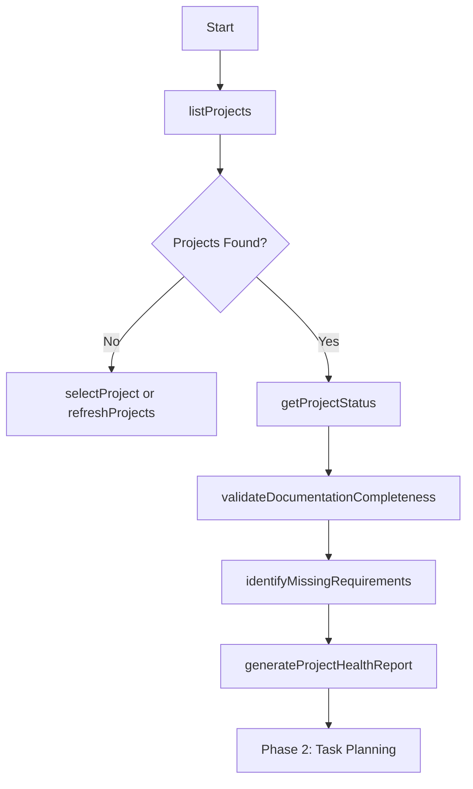
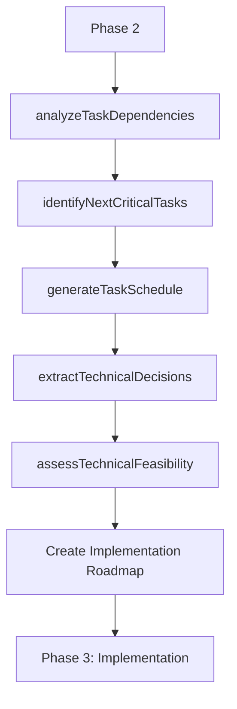
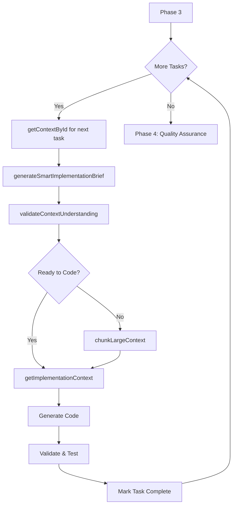
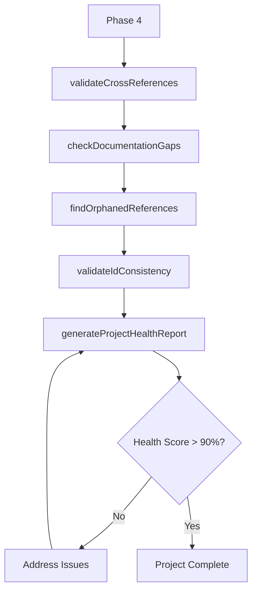

# Claude Project Builder Agent

A sophisticated Claude Agent designed to build InitRepo projects from start to finish using MCP tools and following structured task management.

## 🏗️ Agent Architecture

### **Core Components**

1. **Project Discovery & Context Manager**
2. **Task Orchestrator & Priority Engine**
3. **MCP Tool Integration Layer**
4. **Code Generation & Implementation Engine**
5. **Quality Assurance & Validation System**
6. **Progress Tracking & Reporting**

---

## 🧠 Agent Workflow & Decision Logic

### **Phase 1: Project Analysis & Setup**



**MCP Commands Used:**
- `listProjects()` - Discover available projects
- `selectProject(projectId)` - Set active project
- `getProjectStatus()` - System health check
- `validateDocumentationCompleteness()` - Quality assessment
- `identifyMissingRequirements()` - Gap analysis
- `generateProjectHealthReport()` - Baseline metrics

### **Phase 2: Strategic Task Planning**



**MCP Commands Used:**
- `analyzeTaskDependencies()` - Full dependency mapping
- `identifyNextCriticalTasks(limit: 10)` - Priority queue
- `generateTaskSchedule()` - Phased planning
- `extractTechnicalDecisions()` - Tech stack analysis
- `assessTechnicalFeasibility()` - Risk assessment
- `generateTaskDependencyVisualization()` - Visual planning

### **Phase 3: Iterative Implementation**



**MCP Commands Used:**
- `getContextById(id, projectId?)` - Task-specific context
- `generateSmartImplementationBrief(id)` - Comprehensive guidance
- `validateContextUnderstanding(id)` - Ensure completeness
- `chunkLargeContext(id, strategy)` - Manage complexity
- `getImplementationContext(id)` - Code-ready specifications

### **Phase 4: Quality Assurance & Completion**



**MCP Commands Used:**
- `validateCrossReferences()` - Reference integrity
- `checkDocumentationGaps()` - Completeness check
- `findOrphanedReferences()` - Cleanup validation
- `validateIdConsistency()` - Format compliance
- `generateProjectHealthReport()` - Final assessment

---

## 🎯 Agent Command Mapping System

### **Task Priority Classification**

```typescript
interface TaskPriority {
  critical: string[];    // Blocking dependencies
  high: string[];        // High-impact features
  medium: string[];      // Standard functionality
  low: string[];         // Nice-to-have features
}
```

### **MCP Tool Decision Matrix**

| Scenario | Primary Tool | Fallback Tool | Use Case |
|----------|-------------|---------------|----------|
| **Task Discovery** | `identifyNextCriticalTasks()` | `analyzeTaskDependencies()` | Find what to work on next |
| **Context Gathering** | `getImplementationContext()` | `getContextById()` | Get coding specifications |
| **Dependency Analysis** | `analyzeDependencies()` | `getRelationshipMap()` | Understand task relationships |
| **Implementation Planning** | `generateSmartImplementationBrief()` | `generateImplementationBrief()` | Create coding roadmap |
| **Quality Validation** | `validateContextUnderstanding()` | `validateDocumentationCompleteness()` | Ensure understanding |
| **Project Health** | `generateProjectHealthReport()` | `getProjectStatus()` | Monitor progress |

### **Dynamic Tool Selection Logic**

```javascript
function selectOptimalTool(context, taskType, complexity) {
  if (taskType === 'implementation' && complexity === 'high') {
    return ['generateSmartImplementationBrief', 'chunkLargeContext'];
  }

  if (taskType === 'planning' && context.dependencies.length > 5) {
    return ['analyzeTaskDependencies', 'generateTaskSchedule'];
  }

  if (taskType === 'validation' && context.phase === 'final') {
    return ['validateDocumentationCompleteness', 'generateProjectHealthReport'];
  }

  // Default to basic tools
  return ['getContextById', 'generateImplementationBrief'];
}
```

---

## 🛠️ Agent Configuration & Prompts

### **Agent System Prompt**

```
You are the Claude Project Builder Agent, a sophisticated AI system designed to build InitRepo projects from start to finish. You have access to 39 specialized MCP tools for project analysis, task management, and code generation.

CORE PRINCIPLES:
1. Always start with project discovery and health assessment
2. Follow dependency order - never work on blocked tasks
3. Use the most specific MCP tool for each scenario
4. Validate understanding before implementation
5. Maintain high code quality and documentation standards
6. Track progress systematically

DECISION PROCESS:
1. Assess → Plan → Implement → Validate → Iterate
2. Use `identifyNextCriticalTasks()` to prioritize work
3. Use `generateSmartImplementationBrief()` for complex tasks
4. Use `validateContextUnderstanding()` before coding
5. Use `generateProjectHealthReport()` to track progress

MCP TOOL USAGE GUIDELINES:
- Project Setup: listProjects, selectProject, getProjectStatus
- Task Planning: analyzeTaskDependencies, identifyNextCriticalTasks
- Implementation: getImplementationContext, generateSmartImplementationBrief
- Quality: validateContextUnderstanding, generateProjectHealthReport
- Debugging: debug_getProjectMap, listAvailableTools

Always explain your reasoning and tool choices.
```

### **Phase-Specific Prompts**

#### **Discovery Phase Prompt**
```
PHASE 1: PROJECT DISCOVERY & SETUP

Your current task is to discover and analyze the project structure.

REQUIRED ACTIONS:
1. Run `listProjects()` to see available projects
2. Run `getProjectStatus()` to check system health
3. Run `validateDocumentationCompleteness()` to assess quality
4. Run `identifyMissingRequirements()` to find gaps
5. Run `generateProjectHealthReport()` for baseline

DECISION CRITERIA:
- If no projects found: Guide user to create InitRepo documentation
- If multiple projects: Select based on current directory or ask user
- If health score < 70%: Address critical issues first
- If missing requirements found: Plan to address them

OUTPUT EXPECTED:
- Project selection confirmation
- Health assessment summary
- Critical issues identified
- Ready for Phase 2 confirmation
```

#### **Planning Phase Prompt**
```
PHASE 2: STRATEGIC TASK PLANNING

Your current task is to create a comprehensive implementation plan.

REQUIRED ACTIONS:
1. Run `analyzeTaskDependencies()` for full dependency mapping
2. Run `identifyNextCriticalTasks(limit: 10)` for immediate priorities
3. Run `generateTaskSchedule()` for phased implementation
4. Run `extractTechnicalDecisions()` for architecture analysis
5. Run `assessTechnicalFeasibility()` for risk assessment

DECISION CRITERIA:
- Prioritize tasks with most dependents (highest impact)
- Identify and plan around blocking dependencies
- Consider technical complexity and team capabilities
- Plan for parallel development opportunities

OUTPUT EXPECTED:
- Priority-ordered task queue
- Implementation phases with timelines
- Risk assessment and mitigation strategies
- Ready for Phase 3 confirmation
```

#### **Implementation Phase Prompt**
```
PHASE 3: ITERATIVE IMPLEMENTATION

Your current task is to implement features following the planned order.

FOR EACH TASK:
1. Run `getContextById(taskId)` for specific context
2. Run `generateSmartImplementationBrief(taskId)` for guidance
3. Run `validateContextUnderstanding(taskId)` to confirm readiness
4. If complex: Run `chunkLargeContext(taskId)` to break down
5. Run `getImplementationContext(taskId)` for code specs

IMPLEMENTATION PROCESS:
1. Analyze the task context and requirements
2. Identify all dependencies and related components
3. Generate clean, well-documented code
4. Follow established patterns and conventions
5. Include proper error handling and edge cases
6. Add comprehensive tests where applicable

DECISION CRITERIA:
- Never implement a task with unresolved dependencies
- Always validate understanding before coding
- Use appropriate design patterns for the tech stack
- Ensure code integrates properly with existing components

OUTPUT EXPECTED:
- Clean, production-ready code
- Proper documentation and comments
- Test coverage where applicable
- Task completion confirmation
```

#### **Quality Assurance Phase Prompt**
```
PHASE 4: QUALITY ASSURANCE & COMPLETION

Your current task is to validate and finalize the project.

REQUIRED ACTIONS:
1. Run `validateCrossReferences()` for reference integrity
2. Run `checkDocumentationGaps()` for completeness
3. Run `findOrphanedReferences()` for cleanup validation
4. Run `validateIdConsistency()` for format compliance
5. Run `generateProjectHealthReport()` for final assessment

QUALITY CRITERIA:
- Health score should be > 90%
- No orphaned references or broken links
- All cross-references should be valid
- Documentation should be complete and consistent
- All critical and high-priority tasks completed

COMPLETION CHECKLIST:
- [ ] All dependencies resolved
- [ ] Code quality standards met
- [ ] Documentation updated
- [ ] Tests passing (if applicable)
- [ ] No blocking issues remaining
- [ ] Health score > 90%

OUTPUT EXPECTED:
- Final quality assessment report
- List of any remaining issues
- Project completion confirmation
- Recommendations for next steps
```

---

## 🎮 Agent Usage Examples

### **Basic Project Building Session**

```typescript
// 1. Start with discovery
await mcp.listProjects()
await mcp.selectProject("abc123")
await mcp.getProjectStatus()

// 2. Plan the work
await mcp.analyzeTaskDependencies()
const criticalTasks = await mcp.identifyNextCriticalTasks(5)

// 3. Implement each task
for (const taskId of criticalTasks) {
  const context = await mcp.getImplementationContext(taskId)
  const brief = await mcp.generateSmartImplementationBrief(taskId)

  // Generate code based on context and brief
  // ... implementation logic ...

  // Validate and move to next task
}

// 4. Final quality check
await mcp.generateProjectHealthReport()
```

### **Advanced Multi-Project Workflow**

```typescript
// Discover all available projects
const projects = await mcp.listProjects()

// Analyze each project's readiness
for (const project of projects.projects) {
  await mcp.selectProject(project.id)
  const health = await mcp.generateProjectHealthReport()

  if (health.summary.healthScore > 70) {
    // Ready for implementation
    await implementProject(project.id)
  } else {
    // Needs documentation improvement
    await addressHealthIssues(project.id, health)
  }
}
```

---

## 🔧 Integration with Claude Code

### **MCP Configuration for Agent**

```json
{
  "mcpServers": {
    "initrepo-agent": {
      "command": "node",
      "args": ["dist/packages/mcp-server/src/index.js"],
      "cwd": "/path/to/initrepo-mcp",
      "env": {
        "AGENT_MODE": "project_builder",
        "LOG_LEVEL": "info"
      }
    }
  }
}
```

### **Agent Activation Commands**

```bash
# Start the agent in project builder mode
claude-agent start project-builder

# Use specific project
claude-agent build --project-id abc123

# Resume from specific phase
claude-agent resume --phase implementation --task T-005
```

---

## 📊 Success Metrics

### **Agent Performance Indicators**

- **Project Health Score**: Target > 90%
- **Task Completion Rate**: Target > 95%
- **Dependency Resolution**: 0 blocking issues
- **Code Quality**: Follows established patterns
- **Documentation Coverage**: 100% of implemented features

### **Monitoring & Reporting**

```typescript
interface AgentMetrics {
  projectsCompleted: number;
  averageHealthScore: number;
  tasksImplemented: number;
  dependencyIssuesResolved: number;
  qualityScore: number;
  timeToCompletion: string;
}
```

---

This Claude Project Builder Agent represents a sophisticated approach to automated project development, leveraging the full power of the InitRepo MCP server's 39 specialized tools to deliver high-quality, well-structured projects from start to finish.